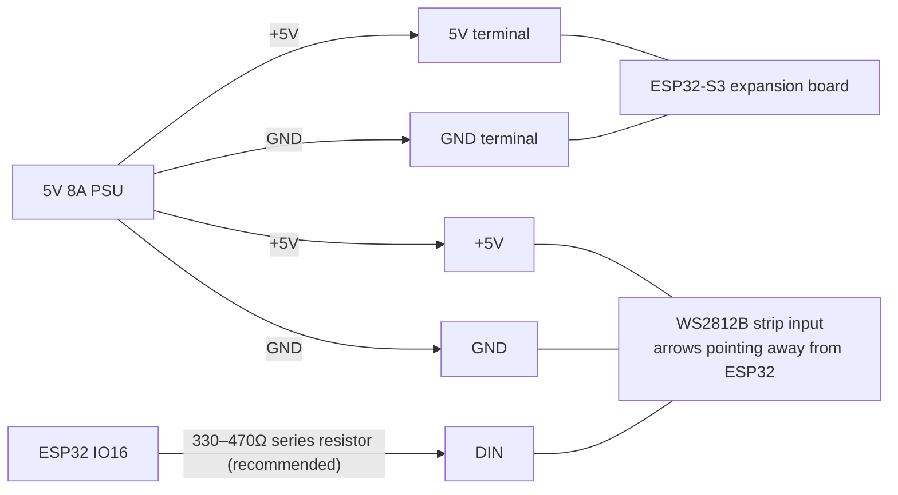

# WLED Desk Lights

ESP32 powered under-desk LED lighting

## Kit

[BTF-LIGHTING WS2812B 16.4ft 5m 60LEDs/Pixels/m 300LEDs Black PCB IP30](https://www.amazon.co.uk/dp/B01CDTEJBG) - cut to 93 LEDs (about 1.55m)

[BTF-LIGHTING 5V 8A/40W UK PSU UKCA for WS2812B/SK6812LED Strip & CCTV](https://www.amazon.co.uk/dp/B0GDQTW28D)

[ESP32-S3 DevKitC-1 N16R8 Module, with Expansion Board for ESP32 S3 1-N16R8 Development Board with WiFi, Bluetooth 5.0, for ESP32 USB C Connectable Antenna](https://www.amazon.co.uk/dp/B0FKBLR2KF)

## Aim

LED strip that can be controlled over wifi on the LAN via a simple CLI & probably a web hook, so it can be used to show status for coding agents, switch on and off based on laptop power status, theme-changed by a user etc.

It doesn't need any auth layer.

[WLED](https://kno.wled.ge/) should be the basis for the software on the ESP32.

## Wiring

The strip is cut to 93 LEDs (about 1.55m at 60 LEDs/m). Power the ESP32 and
strip in parallel from the 5V supply; do not pass the strip's power through
the ESP32 board.




| From         | To                                                             |
| ------------ | -------------------------------------------------------------- |
| PSU `+5V`    | ESP32 expansion board `5V`                                     |
| PSU `GND`    | ESP32 expansion board `GND`                                    |
| PSU `+5V`    | LED strip `+5V` at the input end                               |
| PSU `GND`    | LED strip `GND` at the input end                               |
| ESP32 `IO16` | LED strip `DIN`, preferably through a 330–470Ω series resistor |


The PSU, ESP32 and strip must share a common ground. Connect data to the strip
end marked `DIN`, with the strip's arrows pointing away from the controller.
Only the input end is powered; no far-end power injection is used.

Disconnect the external 5V supply before connecting the ESP32 to USB for
flashing or debugging.

## WLED configuration

- LED type: `WS281x`
- GPIO: `16`
- Length: `93`
- Colour order: `GRB`
- Automatic brightness limiter: enabled
- Maximum current: `4000 mA`


## Running system

[http://wled-desk.local/](http://wled-desk.local/)

## CLI

The dependency-free `desk-lights` command controls WLED over its JSON API:

```sh
./desk-lights pink
./desk-lights blue
./desk-lights pulse
./desk-lights off
./desk-lights status
```

`pulse` applies WLED's Breathe effect while keeping the current colour. You can
also set the brightness (WLED uses a 1–255 scale):

```sh
./desk-lights pink --brightness 180
```

To make the command available everywhere, copy it to a directory on your
`PATH`, for example:

```sh
mkdir -p ~/.local/bin
install -m 755 desk-lights ~/.local/bin/desk-lights
```

It connects to `wled-desk.local` by default. Override that for a controller
with a different hostname or IP address:

```sh
DESK_LIGHTS_HOST=192.168.1.42 desk-lights blue
# or
desk-lights blue --host 192.168.1.42
```

Run the tests with:

```sh
python3 -m unittest discover -s tests
```
